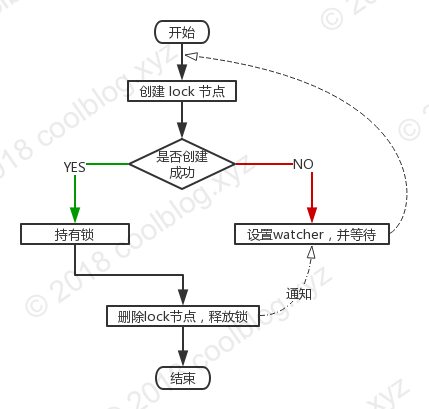

# basic-research
java技术基础研究
## 分布式锁的设计要点
* 可以保证在分布式部署的应用集群中，同一个方法在同一时间只能被一台机器上的一个线程执行
* 这把锁要是一把可重入锁（避免死锁）
* 这把锁最好是一把阻塞锁（根据业务需求考虑要不要这条）
* 有高可用的获取锁和释放锁功能
* 获取锁和释放锁的性能要好


## mysql实现分布式锁
使用mysql实现分布式锁的基本原理就是利用mysql本身的X锁。具体的实现就是分为insert和for update两种
方式。经过大量的调研，使用mysql难以克服的就是死锁的问题，比如这篇文章指出的那样: 
**https://www.cnblogs.com/micrari/p/8029710.html**
所以在使用mysql实现分布式锁之前需要搞明白它的锁机制，这里我推荐一篇比较经典的文章:
**http://hedengcheng.com/?p=771**。总结该文章的要点就是:<br/>
如果执行的sql语句为**delete from t1 where id = 10**
+ 1 组合一:id主键+RC；**结论是id是主键时，此SQL只需要在id=10这条记录上加X锁即可。**
  
+ 2 组合二:id唯一索引+RC;**结论是sql需要加两个X锁，一个对应于id unique索引上id=10的记录，另一把锁对应聚簇索引上的
[name='d',id=10]的记录**
  
+ 3 组合三:id非唯一索引+RC;**结论是满足sql查询条件的所有记录都会被加锁，同时主键上对应的记录也会加锁。**
  
+ 4 组合四:id无索引+RC;**结论是sql会走聚簇索引的全表扫描，但是由于过滤是在Mysql Server层面，所以每一条记录不论是否
满足条件都会加上X锁。当是为了效率的优化，对于不满足条件的记录，会在判断后放锁，最终持有的，是满足条件的记录上的锁，
但是不满足条件的记录上的加锁/放锁动作不会省略。同时，优化也违背了2PL的约束。**
  
+ 5 组合五:id主键+RR;结论是与组合一一致。
+ 6 组合六:id唯一索引+RR;结论是与组合二一致。
+ 7 组合七:id非唯一索引+RR;**结论是Repeatable Read隔离级别下，id列上有一个非唯一索引，对应SQL：
delete from t1 where id = 10; 首先，通过id索引定位到第一条满足查询条件的记录，加记录上的X锁，加GAP上的GAP锁，
然后加主键聚簇索引上的记录X锁，然后返回；然后读取下一条，重复进行。直至进行到第一条不满足条件的记录[11,f]，此时，
不需要加记录X锁，但是仍旧需要加GAP锁，最后返回结束。**
  
+ 8 组合八:id无索引+RR;**结论是在Repeatable Read隔离级别下，如果进行全表扫描的当前读，那么会锁上表中的所有记录，
同时会锁上聚簇索引内的所有GAP，杜绝所有的并发 更新/删除/插入 操作。**
  <br/>
这里文章还有一个比较重要的问题没有给出答案:
**如果组合五、组合六下，针对SQL：select * from t1 where id = 10 for update; 
第一次查询，没有找到满足查询条件的记录，那么GAP锁是否还能够省略？从后续的文章分析来看结论应该是:**
    + 1 找到满足条件的记录，并且记录有效，则对记录加X锁，No Gap锁(lock_mode X locks rec but not gap);
    + 2 找到满足条件的记录，但是记录无效(标识为删除的记录)，则对记录加next key锁(同时锁住记录本身，以及记录之前的Gap:lock_mode X);
    + 3 未找到满足条件的记录，则对第一个不满足条件的记录加Gap锁，保证没有满足条件的记录插入(locks gap before rec);
<br/>
所以在没有找到满足条件的记录但记录无效**或者**是未找到满足记录的情况下是有可能得到相同gap的锁，此时再进行并发插入可能会出现死锁。

### 1. 使用mysql的插入实现分布式锁
```java
 
      @Override
        public LockResponse acquire(LockRequest lockRequest) throws Exception {
            checkLockRequest(lockRequest);
            LockResponse response = new LockResponse();
            response.setSuccess(false);
            lockRequest.setRetry(1);
            //初始化锁
            DistributeLock distributeLock = initDistributeLock(lockRequest);
            while (true) {
                try {
                    //先查询该机器的线程是否已经获取了锁
                    Long nowTime = System.currentTimeMillis();
                    DistributeLock lock = distributeLockMapper.findOne(lockRequest.getKey(), lockRequest.getDesc());
                    if (lock != null && lock.getCount() >= 1 && lock.getExpireTime().getTime() > nowTime) {
                        lock.setExpireTime(new Date(nowTime + lockRequest.getExpireTime()));
                        distributeLockMapper.acquireReentryLock(lock);
                        response.setSuccess(true);
                        return response;
                    }
                    nowTime = System.currentTimeMillis();
                    distributeLock.setExpireTime(new Date(nowTime + lockRequest.getExpireTime()));
                    distributeLockMapper.insertRecord(distributeLock);
                    response.setSuccess(true);
                    return response;
                } catch (Exception e) {
                    //获取锁失败，自旋
                    Thread.sleep(20);
                    lockRequest.setRetry(lockRequest.getRetry() + 1);
                    if (lockRequest.getRetry() <= MAX_RETRY) {
                        continue;
                    }
                    return response;
                }
            }
        }
    
        @Override
        public LockResponse release(LockRequest lockRequest) throws Exception {
            checkLockRequest(lockRequest);
            lockRequest.setRetry(1);
            LockResponse response = new LockResponse();
            response.setSuccess(false);
            while (true) {
                try {
                    //这里如果重入，那么瞬间的多个删除请求过来，发生死锁
                    Integer rows = distributeLockMapper.releaseReentryLock(lockRequest.getKey(),lockRequest.getDesc());
                    if (rows > 0) {
                        //释放重入锁成功
                        DistributeLock lock = distributeLockMapper.findOne(lockRequest.getKey(), lockRequest.getDesc());
                        //如果需要该重入锁已经完毕
                        if (lock != null && lock.getCount() <= 0) {
                            distributeLockMapper.deleteRecord(lockRequest.getKey());
                        }
                    } else {
                        distributeLockMapper.deleteRecord(lockRequest.getKey());
                    }
                    response.setSuccess(true);
                    return response;
                } catch (Exception e) {
                    Thread.sleep(20);
                    lockRequest.setRetry(lockRequest.getRetry() + 1);
                    if (lockRequest.getRetry() <= MAX_RETRY) {
                        continue;
                    }
                    return response;
                }
            }
        }

```
经过测试，该重入锁能够首先满足分布式锁的需求，而且带有重入的功能。具体的测试可以看测试案例。注意
使用重入锁的时候需要注意此时不能保证进程安全。

## Redis实现分布式锁
   redis实现分布式锁在网上可以找到很多的版本，但实际上高并发场景下死锁，锁失效（多个客户端同时获取到锁）
等情况。所以也有很多文章讨论redis的分布式锁的可行性。下面我们首先从简单redis分布式锁开始，讨论各种实现的
差异。
### 简单实现
   SETNX 可以直接加锁操作，比如说对某个关键词foo加锁，客户端可以尝试**SETNX lock** 如果返回1，
表示客户端已经获取锁，可以往下操作，操作完成后，通过**DEL lock**命令来释放锁。如果返回0，说明lock
已经被其他客户端上锁，如果锁是非堵塞的，可以选择返回调用。如果是堵塞调用调用，就需要进入以下个重试循环，
直至成功获得锁或者重试超时。伪代码如下
```java
boolean tryLock(String key, int lockSeconds) {
  if (SETNX key "1" == 1) {
    EXPIRE key lockSeconds
    return true
  } else {
    return false
  }
}
boolean unlock(String key) {
  DEL key
}
```

### 死锁
   在上面的处理方式中，如果获取锁的客户端端执行时间过长，进程被kill掉，或者因为其他异常崩溃，导致无法释放锁，就会造成死锁。
所以，需要对加锁要做时效性检测。因此，我们在加锁时，**把当前时间戳作为value存入此锁中，通过当前时间戳和Redis中的时间戳进行对比，
如果超过一定差值，认为锁已经失效，防止锁无限期的锁下去**.但是，在大并发情况，如果同时检测锁失效，并简单粗暴的删除死锁，再通过SETNX上锁，
可能会导致竞争条件的产生，即多个客户端同时获取锁。
  + C1获取锁，并崩溃。C2和C3调用SETNX上锁返回0后，获得lock的时间戳，通过比对时间戳，发现锁超时。
  + C2 向lock发送DEL命令。
  + C2 向lock发送SETNX获取锁。
  + C3 向lock发送DEL命令，此时C3发送DEL时，其实DEL掉的是C2的锁。
  + C3 向lock发送SETNX获取锁。<br/>

当Redis服务器收到这样的指令序列时，C1和C2的SETNX都同时返回了1，此时C1和C2都认为自己拿到了锁，这种情况明显是不符合预期的。
为解决这个问题，Redis的GETSET命令就派上用场了。客户端可以使用GETSET命令去设置自己的过期时间，然后得到的返回值与之前GET到的返回值进行比较，
如果不同，则表示这个过期的锁被其他客户端抢占了（此时GETSET命令其实已经生效，也就是说key中的过期时间已经被修改，不过此误差很小，可以忽略不计）。

### getset改进
   C1获取锁，并崩溃。C2和C3调用SETNX上锁返回0后，调用GET命令获得lock的时间戳T1，通过比对时间戳，发现锁超时。
C2向lock发送GESET命令，GETSET lock <current unix time> 并得到lock中老的时间戳T2.如果T1=T2，说明C2获得锁。
如果T1!=T2，说明C2之前有另外一个客户端C3通过调用GETSET方式获取了时间戳，C2未获得锁。只能sleep下，进入下次循环中。
当是通过比较get和getset两次的时间来获取到锁，依然有不足。因为get和getset都有可能返回null。考虑一下场景
C1和C2的setNX都没有获取到锁，进入get，C1的get返回了T1，此时C3获取了锁，然后删除了锁，最后C2的get
返回了T2。显然此时T2的值为null。那么当C1使用getset获取锁时T11的值为null，C2使用getset的值为
T1的值。所以T1和T2都没有获取到锁，但是实际上T1获取到了锁，但是他的处理逻辑没有考虑GETSET返回null的情况，
只是单纯的用GET和GETSET值就行对比。<br/>  

| 客户端  | get      | getset |
| ------ | ------   | ------ |
| C1     | T1       | T11(null)|
| C2     | T2(null) | T2=T1   |

综上所述get和getset改进的分布式锁为：
```java
 while (true) {
            if(++retryTime > maxTryCount) {
                // 获取锁超时
                return response;
            }
            long nowTime = System.currentTimeMillis();
            // 容忍不同服务器时间有1秒内的误差
            long expireTime = nowTime + lockRequest.getExpireTime() * 1000 + 1000;
            String key = lockRequest.getKey();
            if (redisService.setNX(key, longToBytes(expireTime))) {
                //这里setNX和expire不是原子性的，所以为了防止获取到锁的服务器或者进程kill导致的死锁，需要将setNX设置的时间get出来，进行比较
                redisService.expire(key, expireTime);
                response.setSuccess(true);
                return response;
            } else {
                //这里通过get和getset两次值进行比较，如果两次获取到的时间一致，那么认为获取锁。但是getset返回null值同样会出现死锁
                //别的客户端的超时时间
                byte[] oldExpireTime = (byte[]) redisService.get(key);
                if (oldExpireTime != null && bytesToLong(oldExpireTime) < nowTime) {
                    // 这个锁已经过期了，可以获得它
                    // PS: 如果setNX和expire之间客户端发生崩溃，可能会出现这样的情况
                    byte[] oldExpireTime2 = (byte[]) redisService.getset(key, longToBytes(expireTime));
                    if(oldExpireTime2 == null) {
                        //如果出现了这种情况，那么说明在get和getset之间还有del操作，根据分析此时应该获取到锁
                        redisService.expire(key, expireTime);
                        response.setSuccess(true);
                        return response;
                    } else if (Arrays.equals(oldExpireTime, oldExpireTime2)) {
                        //这里可以忽略掉getset的耗时，即获得了锁
                        redisService.expire(key, expireTime);
                        response.setSuccess(true);
                        return response;
                    } else {
                        // 被别人抢占了锁，setNX重试
                        try {
                            //这里sleep是为了减少对redis的压力
                            Thread.sleep(tryIntervalMillis);
                        } catch (InterruptedException e) {
                            response.setSuccess(false);
                            return response;
                        }
                    }
                } else {
                    //表示锁已经被删除了或者还未超时，setNX重试
                    try {
                        //这里sleep是为了减少对redis的压力
                        Thread.sleep(tryIntervalMillis);
                    } catch (InterruptedException e) {
                        response.setSuccess(false);
                        return response;
                    }
                }
            }
        }
```
以上分布式锁经过测试，可以满足要求
###时间戳的问题

我们看到lock的value值为时间戳，所以要在多客户端情况下，保证锁有效，一定要同步各服务器的时间，如果各服务器间，时间有差异。时间不一致的客户端，
在判断锁超时，就会出现偏差，从而产生竞争条件。锁的超时与否，严格依赖时间戳，时间戳本身也是有精度限制，假如我们的时间精度为秒，从加锁到执行操作再到解锁，
一般操作肯定都能在一秒内完成。这样的话，我们上面的CASE，就很容易出现。所以，最好把时间精度提升到毫秒级。这样的话，可以保证毫秒级别的锁是安全的。
所以在代码中我加了1秒的时间容错，但依赖服务器时间的同步还是可能会不靠谱的。

### lua的实现
  可以用一个这样的lua脚本来描述加锁的逻辑
```javascript
  if (redis.call('setnx', KEYS[1], ARGV[1]) == 1) then
       redis.call('expire', KEYS[1], tonumber(ARGV[2]))
       return true 
   else
       return false
   end
``` 
  解锁逻辑
 ```javascript
 if redis.call('get',KEYS[1],ARGV[1] == 1) then 
        redis.call('del', KEYS[1])
        return true
  else
        return false
  end
```
## zookeeper实现分布式锁
zookeeper实现分布式锁的详细过程如下：<br/>
+ 多个客户端竞争创建 lock 临时节点;
+ 其中某个客户端成功创建 lock 节点，其他客户端对 lock 节点设置 watcher;
+ 持有锁的客户端删除 lock 节点或该客户端崩溃，由 Zookeeper 删除 lock 节点;
+ 其他客户端获得 lock 节点被删除的通知;
+ 重复上述4个步骤，直至无客户端在等待获取锁了;

通过上面的原理图，容易实现分布式锁。具体的步骤在代码里面有详细的说明。这里将几个重要的注意点
再次说明下：
```java
  while (true) {
            if (++retry > maxRetryCount) {
                response.setSuccess(false);
                return response;
            }
            List<String> names = zooKeeper.getChildren(dir, false);//所有子节点的节点名
            //2. 判断当前路径是否存在
            String prefix = "x-" + zooKeeper.getSessionId() + "-" + Thread.currentThread().getId() + "-";
            String name = null;
            for (String path : names) {
                if (path.startsWith(prefix)) {
                    //说明该节点已经创建
                    name = dir.concat("/").concat(path);
                    break;
                }
            }
            if (name == null) {
                //说明该节点还没有创建过
                name = dir.concat("/").concat(prefix);
                name = zooKeeper.create(name, data, ZooDefs.Ids.OPEN_ACL_UNSAFE, CreateMode.EPHEMERAL_SEQUENTIAL);
            }
            //3. 判断刚刚创建的节点是否已经删除
            names = zooKeeper.getChildren(dir, false);
            if(names.isEmpty()) {
                continue;
            }
            ZNodeName newNode = new ZNodeName(name);
            SortedSet<ZNodeName> sortedNodes = new TreeSet<ZNodeName>();
            for (String node : names) {
                sortedNodes.add(new ZNodeName(dir.concat("/").concat(node)));
            }
            //排在newNode前面的节点
            SortedSet<ZNodeName> lessThanMe = ((TreeSet<ZNodeName>) sortedNodes).headSet(newNode);
            //4. 判断当前节点是否是第一个节点
            if (lessThanMe.size() < 1) {
                LOG.info(name + "节点获取到锁");
                //说明是第一个节点
                response.setSuccess(true);
                response.setLockPath(name);
                return response;
            }

            //5. 如果还有比自己小的节点，那么监听这个节点的删除
            final CountDownLatch latch = new CountDownLatch(1);
            //注意这里有可能获取完lessThanMe集合里面最小的节点后，在监听之前，改节点被删除了
            String lastNode = lessThanMe.last().getName();
            Stat stat = null;
            try {
                stat = zooKeeper.exists(lastNode, new Watcher() {
                    @Override
                    public void process(WatchedEvent watchedEvent) {
                        if (watchedEvent.getType() == Event.EventType.NodeDeleted) {
                            latch.countDown();
                        }
                    }
                });
            } catch (Exception e) {
                LOG.error("监听节点出错:" + e);
            }
            if (stat == null) {
                //如果已经被删除，那么需要重新监听。所有的情况都是走这个逻辑
                continue;
            }
            LOG.info(name + "正在等待:" + lastNode + "...");
            //如果已经监听了，那么等待监听的节点被删除通知，再次去竞争锁
            //如果使用await(retry * retryDelay, TimeUnit.MILLISECONDS) 那么这里自旋等待非常重要，有可能超时获取不到锁
            latch.await();
        }
```
节点的前缀使用了zooKeeper.getSessionId() + "-" + Thread.currentThread().getId() 
目的是为了确保多个进程的节点相同，此时如果进程A和B同时以节点x为锁，那么A进程可能会删除B的锁。其实使用上面的规则，就是
避免锁的重入（因为和redis一样，不好控制重入的次数）。


## 比较分析
以上三种方式实现的分布式锁都支持阻塞，mysql实现的分布式锁性能比较差，但是容易实现重入。Redis和zk实现的分布式锁性能上比较高，
但是不容易实现重入。在并发量比较低的情况下，Redis表现的比较出色，zk其次，但是如果在高并发情况下zk的性能要远远超过redis，这
主要是redis自旋的时间比较长。


    